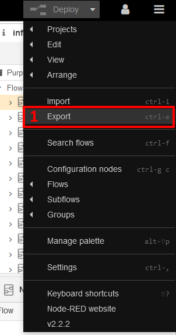
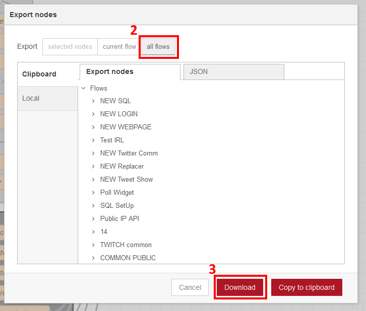

# MaJ Node-Red via docker/docker-compose sans perte de donnée

## Sommaire
- [MaJ Node-Red via docker/docker-compose sans perte de donnée](#maj-node-red-via-dockerdocker-compose-sans-perte-de-donnée)
  - [Sommaire](#sommaire)
  - [Problématique](#problématique)
  - [Prérequis](#prérequis)
    - [Sauvegarder les flows](#sauvegarder-les-flows)
    - [Vérifier que le container a bien un volume attitré (docker)](#vérifier-que-le-container-a-bien-un-volume-attitré-docker)
    - [Vérifier que le container a bien un volume attitré (docker-compose)](#vérifier-que-le-container-a-bien-un-volume-attitré-docker-compose)
  - [Détruire le container](#détruire-le-container)
  - [Repérer l'image docker mise à jour](#repérer-limage-docker-mise-à-jour)
  - [Modifier docker-compose.yml](#modifier-docker-composeyml)
  - [Créer le nouveau container](#créer-le-nouveau-container)
    - [Docker](#docker)
    - [Docker-compose](#docker-compose)
  - [Vérifier le bon fonctionnement](#vérifier-le-bon-fonctionnement)

## Problématique
Lors du déploiement d'un container Node-Red on installe souvent par défaut la dernière version stable pour toutes les distributions linux.
Mais cette version est souvent la 2.X, qui regroupe la majorité des éléments nécessaires à Node-Red, sans apporter les nouveatés comme le travaille de groupe de la 4.X

MaJ de la 2.X vers la 4.X nécessite une mise à jour non seulement de Node-Red mais aussi de NodeJS. Cela peut faire peur à juste titre, notamment sur la perte de ses flows et de la configuration spécifique que l'on a prit le temps de faire dans settings.js.

Cette documentation a pour but de donner la marche à suivre pour le faire sans perte de donnée.

## Prérequis
### Sauvegarder les flows
En cas de perte réel nous allons sauvegarder le JSON contenant tous ce que l'on a configuré dans Node-Red. Généralement les seuls éléments perdus dans ce cas de figure sont les credentials. Cela permet de monter un Node-Red vierge et de tout importer en cas de perte de donnée.

- Connectez vous à l'interface de Node-Red
- Dans le menu d'option en haut à droite sélectionnez "Export" (1)
- Dans la nouvelle fenètre, selectionnez "all flows" (2) puis "Download" (3)
- Le fichier téléchargé comprends tous vos flows de ce serveur, vous pourrez utiliser le menu "import" pour l'ajouter à n'importe quel autre serveur node-red

 

### Vérifier que le container a bien un volume attitré (docker)
Avec docker vous pouvez rattacher des disques virtuels ou des dossiers de votre OS racine à vos containers. Cela permet de conserver des données malgrés que le container soit arrêté.
C'est cette méthode qui va nous permettre d'update la version de Node-Red sans perte de donnée.

- Lister tous vos containers
```console
sudo docker ps -a
```
```console
CONTAINER ID   IMAGE                            COMMAND                  CREATED      STATUS      PORTS                                                                      NAMES
e4be26ef9631   nodered/node-red:latest          "npm --no-update-not…"   4 days ago   Up 4 days   1880/tcp                                                                   debian_purpletwit_node-red_1
378eb23bce79   traefik:v3.0                     "/entrypoint.sh --pr…"   4 days ago   Up 4 days   0.0.0.0:80->80/tcp, :::80->80/tcp, 0.0.0.0:443->443/tcp, :::443->443/tcp   378eb23bce79_traefik
570e71c1d887   nodered/node-red:latest-debian   "./entrypoint.sh"        4 days ago   Up 4 days   1880/tcp                                                                   debian_devisgenerator_node-red_1
f4bba0202aee   nodered/node-red:latest-debian   "./entrypoint.sh"        4 days ago   Up 4 days   1880/tcp                                                                   debian_v4Try_node-red_1
952b05243647   mysql:5.7                        "docker-entrypoint.s…"   4 days ago   Up 4 days   3306/tcp, 33060/tcp                                                        debian_purpletwit_db_1
```
- Récupérer l'ID du container que vous souhaitez update (ici le debian_purpletwit_node-red_1, soit l'ID e4be26ef9631)
- Lister les volumes associés à ce container (en remplacant YourContainerID) et garder ces informations de côté, nous en aurons besoin pour le rattacher au container mis à jour
```console
debian@vps:~$ sudo docker inspect --format='{{json .Mounts}}' YourContainerID | jq
```
```json
[
  {
    "Type": "volume",
    "Name": "debian_purpletwit_node-red-data",
    "Source": "/var/lib/docker/volumes/debian_purpletwit_node-red-data/_data",
    "Destination": "/data",
    "Driver": "local",
    "Mode": "rw",
    "RW": true,
    "Propagation": ""
  }
]
```

### Vérifier que le container a bien un volume attitré (docker-compose)
> [!WARNING]
> Cette méthode se base sur le fichier docker-compose.yml, elle ne permet pas de garantir l'information, je vous conseille d'appliquer la méthode précédente pour vérifier que votre docker-compose.yml est en accord avec la configuration actuelle de docker.
- Dans le fichier docker-compose.yml, retrouver la déclaration du container, la partie "volumes" est à conserver 
```yml
purpletwit_node-red:
    image: nodered/node-red:latest
    environment:
      - TZ=Europe/Paris
    volumes:
      - purpletwit_node-red-data:/data
```

## Détruire le container
> [!WARNING]
> Pour éviter de détruire le volume en même temps que le container, nous allons le faire via les commandes docker directement. Si vous le faites via : docker-compose down, le volume est détruit avec toutes les données.

- Pour détruire le container, (en remplacant YourContainerID) (-f force l'arrêt du container pour le détruire)
```console
sudo docker rm -f YourContainerID
```

## Repérer l'image docker mise à jour
- Se rendre sur le docker hub officiel de l'image Node-Red [ici](https://hub.docker.com/r/nodered/node-red/tags)
- Sélectionner l'image adaptée à votre OS
- Ne pas utiliser le tag 'latest' qui va vous distribuer la version 2.X de node-red
- Je conseille d'utiliser le tag 'latest-debian' qui va vous distribuer la vrai dernière version stable de l'OS debian

## Modifier docker-compose.yml
- Changer le tag de votre image docker par le tag obtenu précédemment
```yml
purpletwit_node-red:
    image: nodered/node-red:latest-debian
    environment:
      - TZ=Europe/Paris
    volumes:
      - purpletwit_node-red-data:/data
```

## Créer le nouveau container
### Docker
- Lancer le container (remplacer myNodeREDdata par le nom de votre volume repéré en début de procédure)
```console
sudo docker run -it -p 1880:1880 -v myNodeREDdata:/data --name mynodered nodered/node-red:latest-debian
```

### Docker-compose
- Lancer le container
```console
sudo docker-compose up -d
```

## Vérifier le bon fonctionnement
- Se connecter à l'interface de Node-Red, si votre volume a bien été relié, le mot de passe est resté le même
- Se rendre dans les options et vérifier la version en bas du menu